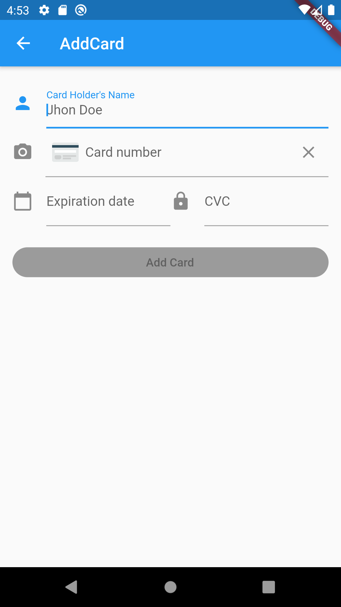

# Paymentez AddCard SDK  - paymentez_mobile

Paymentez AddCard SDK is a library that allows developers to easily connect to the Paymentez CREDITCARDS API

## Installation

Add the SDK inside pubspec.yaml:
##
     dependencies:
		paymentez_mobile:
			git:
      		  url: https://git@bitbucket.org/paymentez/paymentez_mobile.git
      		  ref: master

#

## Android Integration (or Gradle)

## ProGuard

If you're planning on optimizing your app with ProGuard, make sure that you exclude the Paymentez bindings.
You can do this by adding the following to your app's proguard.cfg file:
##
		-keep class com.paymentez.android.** { *; }
##

## Xcode Integration

Requirements
Version <= 1.4.x

iOS 9.0 or Later
Xcode 9
Version >= 1.5.x

iOS 9.0 or Later
Xcode 10
Framework Dependencies:

Accelerate AudioToolbox AVFoundation CoreGraphics CoreMedia CoreVideo Foundation MobileCoreServices OpenGLES QuartzCore Security UIKit CommonCrypto (Just for version 1.4)

Project Configuration

- ObjC in other linker flags in target
- lc++ in target other linker flags
- Disable Bitcode

# Usage

##

To use the SDK you have to add [flutter_bloc](https://pub.dev/packages/flutter_bloc) dependency inside pubspec.yaml :
##
		dependencies:
			flutter_bloc: ^4.x.x
##

# Flutter integration
##
## For the creation of add card form, can create the widget with BlocProvider and the AddCardBloc:
##

	import 'package:paymentez_mobile/add_card/add_card_form.dart';
	import 'package:paymentez_mobile/add_card/bloc/bloc.dart';
	import 'package:paymentez_mobile/config/bloc.dart';
	import 'package:paymentez_mobile/repository/model/user.dart';
	import 'package:paymentez_mobile/repository/paymentez_repository.dart';
	import 'package:paymentez_mobile/simple_bloc_delegate.dart';

	return CustomScaffold(
        backgroundColor: Colors.white,
        appBar: CustomAppBar(),
        body: BlocProvider(
            create: (context) => ConfigBloc()
              ..add(SetEnvironment(
                  testMode: //You can use the environments 'stg' for develop or 'prod' for production environment,
                  isFlutterAppHost: false,
                  paymentezClientAppCode: //ccapiClientAppCode provided by Paymentez,
                  paymentezClientAppKey: //ccapiClientKey provided by Paymentez)),
            child:
                BlocBuilder<ConfigBloc, ConfigState>(builder: (context, state) {
              if (state.initiated != true) {
                //State waiting for connection
              }else {
                var _paymentezRepository = PaymentezRepository(
                    configState: state,
                    successAction: (card) {
                      switch (card.status) {
                        case 'valid':
                         //card is valid
                          break;
                        case 'review':
                        //card in review
                          break;
                        default:
                          break;
                      }
                    },
                    errorAction: (error) {
                      //Add card error
                    },
                    user: User(
                        id: //Set the unique identifier of the user (optional),
                        email: //Set the email user(optional),
                        ipAddress: //Set the ip address (optional),
                        fiscalNumber: //Set the fiscal number (optional)));

                return BlocProvider<AddCardBloc>(
                    create: (context) =>
                        AddCardBloc(paymentezRepository: _paymentezRepository),
                    child: AddCardForm(
                        paymentezRepository: _paymentezRepository,
                        title: //Set the widget for the title of addcard screen,
                        aboveButton: //Set the widget for message aboce the submitbutton,
                        summitButton: // Set custom widget for the submitt button));
              }
            })));
##

## SDK validations

The SDK allows you to validate user input before you send the information to Paymentez.

- Checks that the number is formatted correctly and passes the [Luhn check](https://en.wikipedia.org/wiki/Luhn_algorithm).
- Checks whether or not the expiration date represents an actual month in the future.
- Validate card number, expiry date and CVC.

## Support internationalization

Paymentez AddCard SDK supports internationalization (spanish, english & portuguese).

## Building and Running the Paymentez AddCard SDK

Before you can run the Paymentez AddCard SDK integration, you need to provide it with your Paymentez Credentials.

1. If you don't have any Credentials yet, please ask your contact on Paymentez Team for it.
2. Replace the ccapiClientAppCode and ccapiClientKey constants in Constants.dart with your own Paymentez Client Credentials.
3. Run the Project.

Important Note: if you only have one appCode, please asume that it's your ccapiClientAppCode. So you need to ask your contact on Paymentez Team for your ccapiClientKey.

